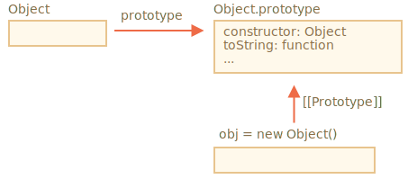
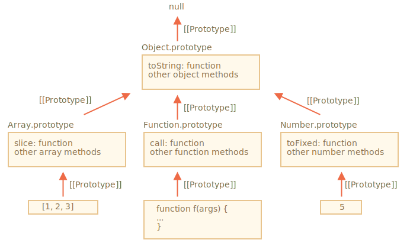
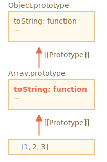

# Prototypes natifs

La propriété `"prototype"` est largement utilisée au centre de JavaScript lui-même. Toutes les fonctions constructeurs intégrées l'utilisent.

Nous verrons d’abord les détails, puis comment l’utiliser pour ajouter de nouvelles fonctionnalités aux objets intégrés.

## Object.prototype

Disons que nous produisons un objet vide:

```js run
let obj = {};
alert( obj ); // "[object Object]" ?
```

Où est le code qui génère la chaîne `"[object Object]"`? C'est une méthode `toString` intégrée, mais où est-elle? Le `obj` est vide!

...Mais la notation abrégée `obj = {}` est identique à `obj = new Object()`, où `Object` est une fonction constructeur de l'objet intégrée, avec son propre `prototype` référençant un énorme objet avec `toString` et d'autres méthodes.

Voici ce qui se passe:


Lorsque `new Object()` est appelé (ou un objet littéral `{...}` est créé), le `[[Prototype]]` de celui-ci est défini sur `Object.prototype` conformément à la règle dont nous avons parlé dans le chapitre précédent:



Ainsi, quand on appelle `obj.toString()`, la méthode est extraite de `Object.prototype`.

Nous pouvons le vérifier comme ceci:

```js run
let obj = {};

alert(obj.__proto__ === Object.prototype); // true
// obj.toString === obj.__proto__.toString == Object.prototype.toString
```

Veuillez noter qu'il n'y a plus de `[[Prototype]]` dans la chaîne au dessus de `Object.prototype`:

```js run
alert(Object.prototype.__proto__); // null
```

## Autres prototypes intégrés

D'autres objets intégrés, tels que `Array`, `Date`, `Function` et autres, conservent également des méthodes dans des prototypes.

Par exemple, lorsque nous créons un tableau `[1, 2, 3]`, le constructeur `new Array()` par défaut est utilisé en interne. Donc `Array.prototype` devient son prototype et fournit des méthodes. C'est très efficace en mémoire.

Par spécification, tous les prototypes intégrés ont `Object.prototype` en haut. C'est pourquoi certaines personnes disent que "tout hérite d'objets".

Voici la vue d'ensemble:



Vérifions les prototypes manuellement:

```js run
let arr = [1, 2, 3];

// il hérite de Array.prototype?
alert( arr.__proto__ === Array.prototype ); // true

// puis de Object.prototype?
alert( arr.__proto__.__proto__ === Object.prototype ); // true

// et null tout en haut.
alert( arr.__proto__.__proto__.__proto__ ); // null
```

Certaines méthodes dans les prototypes peuvent se chevaucher, par exemple, `Array.prototype` a son propre `toString` qui répertorie les éléments délimités par des virgules:

```js run
let arr = [1, 2, 3]
alert(arr); // 1,2,3 <-- le résultat de Array.prototype.toString
```

Comme nous l'avons vu précédemment, `Object.prototype` a aussi `toString`, mais `Array.prototype` est plus proche dans la chaîne, la variante de tableau est donc utilisée.





Les outils intégrés au navigateur, tels que la console de développement Chrome, affichent également l'héritage (il faut éventuellement utiliser `console.dir` pour les objets intégrés):


Les autres objets intégrés fonctionnent également de la même manière. Même les fonctions - ce sont des objets d'un constructeur intégré `Function`, et leurs méthodes (`call`/`apply` et autres) sont extraites de `Function.prototype`. Les fonctions ont aussi leur propre `toString`.

```js run
function f() {}

alert(f.__proto__ == Function.prototype); // true
alert(f.__proto__.__proto__ == Object.prototype); // true, hérite d'objets
```

## Primitives

Une chose complexe se produit avec les chaînes, les nombres et les booléens.

Comme on s'en souvient, ce ne sont pas des objets. Mais si nous essayons d'accéder à leurs propriétés, des objets wrapper temporaires sont créés à l'aide des constructeurs intégrés `String`,` Number`, `Boolean`, ils fournissent les méthodes et disparaissent.

Ces objets sont créés de manière invisible pour nous et la plupart des moteurs les optimisent, mais la spécification le décrit exactement de cette façon. Les méthodes de ces objets résident également dans des prototypes, disponibles sous les noms `String.prototype`, `Number.prototype` et `Boolean.prototype`.

```warn header="Les valeurs `null` et `undefined` n'ont pas de wrappers d'objet"
Les valeurs spéciales `null` et `undefined` sont distinctes. Ils n'ont pas de wrapper d'objet, donc les méthodes et les propriétés ne sont pas disponibles pour eux. Et il n'y a pas non plus de prototypes correspondants.
```

## Modification des prototypes natifs [#native-prototype-change]

Les prototypes natifs peuvent être modifiés. Par exemple, si nous ajoutons une méthode à `String.prototype`, elle devient disponible pour toutes les chaînes:

```js run
String.prototype.show = function() {
  alert(this);
};

"BOOM!".show(); // BOOM!
```

Au cours du processus de développement, nous pouvons avoir des idées de nouvelles méthodes intégrées que nous aimerions avoir et nous pourrions être tentés de les ajouter à des prototypes natifs. Mais c'est généralement une mauvaise idée.

```warn
Les prototypes sont globaux, il est donc facile de créer un conflit. Si deux bibliothèques ajoutent une méthode `String.prototype.show`, l'une d'elles remplacera la méthode de l'autre.

Donc, généralement, modifier un prototype natif est considéré comme une mauvaise idée.
```

**Dans la programmation moderne, il n'y a qu'un seul cas où la modification de prototypes natifs est approuvée. Le polyfilling.**

Le terme Polyfill décrit l'action de faire un substitut à une méthode qui existe dans la spécification JavaScript, mais pas encore pris en charge par le moteur actuel JavaScript.

Ensuite, nous pouvons l’implémenter manuellement et y ajouter le prototype intégré.

Par exemple:

```js run
if (!String.prototype.repeat) { // s'il n'y a pas une telle méthode
  // ajouter le au prototype

  String.prototype.repeat = function(n) {
    // répéter la chaîne n fois

    // en fait, le code devrait être un peu plus complexe que cela
    // (l'algorithme complet est dans la spécification)
    // mais même un polyfill imparfait est souvent considéré comme suffisant pour être utilisé
    return new Array(n + 1).join(this);
  };
}

alert( "La".repeat(3) ); // LaLaLa
```


## Emprunt de prototypes

Dans le chapitre <info:call-apply-decorators#method-borrowing> nous avons parlé de l'emprunt de méthode.

C'est quand nous prenons une méthode d'un objet et le copions dans un autre.

Certaines méthodes de prototypes natifs sont souvent empruntés.

Par exemple, si nous créons un objet semblable à un tableau, nous voudrons peut-être y copier des méthodes `Array`.

E.g.

```js run
let obj = {
  0: "Hello",
  1: "world!",
  length: 2,
};

*!*
obj.join = Array.prototype.join;
*/!*

alert( obj.join(',') ); // Hello,world!
```

Cela fonctionne car l'algorithme interne de la méthode `join` intégrée ne se préoccupe que des index corrects et de la propriété `length`, il ne vérifie pas que l'objet est bien un tableau. Et beaucoup de méthodes intégrées sont comme ça.

Une autre possibilité consiste à hériter en fixant `obj.__ proto__` sur `Array.prototype`, afin que toutes les méthodes `Array` soient automatiquement disponibles dans `obj`.

Mais c'est impossible si `obj` hérite déjà d'un autre objet. N'oubliez pas que nous ne pouvons hériter que d'un objet à la fois.

L'emprunt des méthodes est flexible, cela permet de mélanger la fonctionnalité des objets différents en cas de besoin.

## Résumé

- Tous les objets intégrés suivent le même schéma:
    - Les méthodes sont stockées dans le prototype (`Array.prototype`, `Object.prototype`, `Date.prototype`, etc.).
    - L'objet lui-même ne stocke que les données (éléments de tableau, propriétés de l'objet, date).
- Les primitives stockent également des méthodes dans des prototypes d'objets wrapper: `Number.prototype`, `String.prototype`, `Boolean.prototype`. Seuls `undefined` et `null` n'ont pas d'objets wrapper.
- Les prototypes intégrés peuvent être modifiés ou remplis avec de nouvelles méthodes. Mais il n'est pas recommandé de les changer. La seule cause possible est probablement l’ajout d’un nouveau standard, mais pas encore pris en charge par la méthode JavaScript du moteur.
