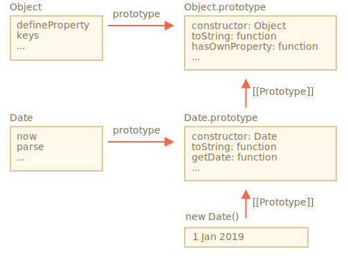

# Extension des classes intégrées

Les classes intégrées telles que Array, Map et autres sont également extensibles.

Par exemple, ici, `PowerArray` hérite du `Array` natif:

```js run
// ajoutez-y une méthode supplémentaire
class PowerArray extends Array {
  isEmpty() {
    return this.length === 0;
  }
}

let arr = new PowerArray(1, 2, 5, 10, 50);
alert(arr.isEmpty()); // false

let filteredArr = arr.filter(item => item >= 10);
alert(filteredArr); // 10, 50
alert(filteredArr.isEmpty()); // false
```

Notez une chose très intéressante. Les méthodes intégrées telles que `filter`, `map` et autres renvoient des nouveaux objets exactement du type hérité `PowerArray`. Leur implémentation interne utilise la propriété d'objet `constructor` pour cela.

Dans l'exemple ci-dessus,
```js
arr.constructor === PowerArray
```

Lorsque `arr.filter()` est appelé, elle crée en interne le nouveau tableau de résultats en utilisant exactement `arr.constructor`, et non pas `Array`. C'est en fait très intéressant, car nous pouvons continuer à utiliser les méthodes `PowerArray` sur le résultat.

Encore plus, nous pouvons personnaliser ce comportement.

<<<<<<< HEAD
Nous pouvons ajouter un accésseur statique spécial `Symbol.species` à la classe. S'il existe, il devrait renvoyer le constructeur que JavaScript utilisera en interne pour créer de nouvelles entités dans `map`, `filter`, etc.
=======
We can add a special static getter `Symbol.species` to the class. If it exists, it should return the constructor that JavaScript will use internally to create new entities in `map`, `filter` and so on.
>>>>>>> 70ca842bef2390bc26d13dea2b856838aa890fe0

Si nous souhaitons que des méthodes intégrées comme `map` ou `filter` renvoient des tableaux classiques, nous pouvons retourner `Array` dans `Symbol.species`, comme ici:

```js run
class PowerArray extends Array {
  isEmpty() {
    return this.length === 0;
  }

*!*
  // les méthodes intégrées l'utiliseront comme constructeur
  static get [Symbol.species]() {
    return Array;
  }
*/!*
}

let arr = new PowerArray(1, 2, 5, 10, 50);
alert(arr.isEmpty()); // false

// filter crée un nouveau tableau en utilisant arr.constructor [Symbol.species] comme constructeur
let filteredArr = arr.filter(item => item >= 10);

*!*
// filteredArr n'est pas PowerArray, mais Array
*/!*
alert(filteredArr.isEmpty()); // Error: filteredArr.isEmpty is not a function
```

Comme vous pouvez le constater, maintenant, `.filter` renvoie `Array`. La fonctionnalité étendue n'est donc plus transmise.

```smart header="D'autres collections fonctionnent de la même manière"
D'autres collections, telles que `Map` et `Set`, fonctionnent de la même manière. Ils utilisent également `Symbol.species`.
```

## Pas d'héritage statique dans les éléments intégrés

Les objets intégrés ont leurs propres méthodes statiques, par exemple `Object.keys`,` Array.isArray` etc.

Comme nous le savons déjà, les classes natives s'étendent les uns des autres. Par exemple, `Array` extends `Object`.

Normalement, lorsqu'une classe en étend une autre, les méthodes statiques et non statiques sont héritées. Cela a été expliqué en détail dans le chapitre [](info:static-properties-methods#statics-and-inheritance).

Mais les classes intégrées sont une exception. Ils n'héritent pas les méthodes statiques les uns des autres.

Par exemple, `Array` et `Date` héritent de `Object`, de sorte que leurs instances ont des méthodes issues de `Object.prototype`. Mais `Array.[[Prototype]]` ne fait pas référence à `Object`, il n'y a donc pas, par exemple, de méthode statique `Array.keys()` (ou `Date.keys()`).

Voici la structure d'image pour `Date` et `Object`:



Comme vous pouvez le constater, il n'y a pas de lien entre `Date` et `Object`. Ils sont indépendants, seul `Date.prototype` hérite de `Object.prototype`.

C'est une différence d'héritage importante entre les objets intégrés par rapport à ce que nous obtenons avec `extends`.
