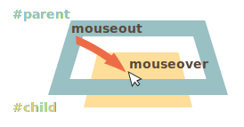
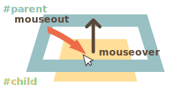

# Déplacer la souris : mouseover/out, mouseenter/leave

Plongeont dans plus de détails sur les événements qui se produisent lorsque la souris se déplace entre les éléments.

## Events mouseover/mouseout, relatedTarget

L'évènement  `mouseover`  est exécuté lorsqu'un pointeur de la souris survole un élément, et `mouseout` -- lorsqu’il le quitte.


Ces événements sont spéciaux, car ils ont la propriété `relatedTarget`. Cette propriété complète `target`. Quand une souris quitte un élément pour un autre, l’un d’eux devient `target`, et l'autre - `relatedTarget`.

Pour  `mouseover`:

- `event.target` -- l'élément que survole la souris.
- `event.relatedTarget` -- voici l'élément  d'origine la souris (`relatedTarget` -> `target`).

A l'inverse du  `mouseout`:

- `event.target` -- est l'élément que la souris a quitté.
- `event.relatedTarget` -- est le nouvel élément situé sous le pointeur, celui pour lequel la souris a quitté (`target` -> `relatedTarget`).

```online
Dans l'exemple ci-dessous  chaque aspect facial  est un élément. Lorsque vous déplacez  la souris, vous pouvez voir les évènements de souris dans la zone de texte.

Chaque événement contient les informations sur `target` et `relatedTarget` :

[codetabs src="mouseoverout" height=280]
```

```warn header="`relatedTarget` peut être  `null`"
La propriété `relatedTarget` peut être  `null`.

C'est normal et cela signifie simplement que la souris de provient pas d'un autre élément, mais hors de la fenêtre  Windows. Ou bien qu'elle a quitté la fenêtre Windows.

Nous devons garder cette éventualité à l'esprit lorsqu'on utilise `event.relatedTarget` dans notre code. Si nous accédons a la propriété `event.relatedTarget.tagName`, alors il y aura une erreur.
```

## Ignorer des éléments

L'évènement  `mousemove`   se déclenche lorsque la souris se déplace. Mais cela ne signifie pas chaque pixel mène a  un évènement.

Le navigateur vérifie la position de la souris de temps en temps. Et s'il remarque des changements, déclenche les événements.

Cela signifie que si le visiteur déplace la souris très rapidement, certains éléments DOM peuvent être ignorés :


Si la souris se déplace très rapidement de `#FROM` aux éléments `#TO` telle que décrite en haut, alors le `<div>`  intermédiaire (ou certains d'entre eux) peuvent être sautés. L'évènement `mouseout` peut être déclenche sur `#FROM` et ensuite immédiatement le `mouseover` sur `#TO`.

C'est bon pour la performance, car s'il peut y avoir beaucoup d'éléments intermédiaires. Nous ne voulons pas vraiment traiter dans et hors de chacun d'entre eux.

D'autre part, nous devons garder à l'esprit que le pointeur de la souris ne "visite" pas tous les éléments le long du chemin. Il peut "sauter".

En particulier, il est possible que le pointeur saute directement au centre de la page depuis l'extérieur de la fenêtre. Dans ce cas `relatedTarget` est `null`, parce qu'il venait de "nulle part" :


```online
Vous pouvez le vérifier "en direct" sur un banc d'essai ci-dessous.

Son code HTML comporte deux éléments imbriqués: la `<div id="child">` est à l'intérieur de `<div id="parent">`. Si vous déplacez rapidement la souris dessus, alors peut-être que seule la div enfant déclenchera les événements, ou peut-être la div parent, ou peut-être qu'il n'y aura aucun événement.

Déplacez également le pointeur dans la `div` enfant, puis le déplacer rapidement en dehors à travers le parent. Si le mouvement est assez rapide, l'élément parent est ignoré. La souris traversera l'élément parent sans le remarquer.

[codetabs height=360 src="mouseoverout-fast"]
```

```smart header="Si `mouseover` est déclenché, il doit y avoir `mouseout`"
En cas de mouvements rapides de la souris, les éléments intermédiaires peuvent être ignorés, mais une chose est sûre : si le pointeur est "officiellement" entré dans un élément (événement `mouseover` généré), alors en le quittant, on aura toujours` mouseout`.
```

## Mouseout en quittant pour un enfant

Une caractéristique importante de `mouseout` -- il se déclenche lorsque le pointeur se déplace d’un élément à son descendant, par ex. de `#parent` à `#enfant` dans ce code HTML :

```html
<div id="parent">
  <div id="child">...</div>
</div>
```

Si nous sommes sur `# parent`, puis déplaçons le pointeur plus profondément dans `#enfant`, nous obtenons `mouseout` sur `#parent`!



Cela semble étrange, mais peut être facilement expliqué.

**Selon la logique du navigateur, le curseur de la souris ne peut survoler qu'*un seul* élément à tout moment - l'élément le plus imbriqué et le plus élevé par z-index.**

Donc, s'il passe à un autre élément (même un descendant), alors il quitte le précédent.

Veuillez noter un autre détail important du traitement de l'événement.

L'événement `mouseover` sur un descendant "bubble up" (remonte). Donc, si `#parent` a un gestionnaire `mouseover`, il se déclenche :



```online
Vous pouvez le voir très bien dans l'exemple ci-dessous : `<div id="child ">` est à l'intérieur de `<div id="parent">`. Il existe des gestionnaires `mouseover/out` sur l'élément `#parent` qui fournissent les détails de l'événement.

Si vous déplacez la souris de `#parent` à `#enfant`, vous voyez deux événements sur `#parent` :
1. `mouseout [target: parent]` (quitte le parent), alors
2. `mouseover [target: child]` (est arrivé à l'enfant, bubbled).

[codetabs height=360 src="mouseoverout-child"]
```

As shown, when the pointer moves from `#parent` element to `#child`, two handlers trigger on the parent element: `mouseout` and `mouseover`:

```js
parent.onmouseout = function(event) {
  /* event.target: parent element */
};
parent.onmouseover = function(event) {
  /* event.target: child element (bubbled) */
};
```

**Si nous n'examinons pas `event.target` à l'intérieur des gestionnaires, il peut alors sembler que le pointeur de la souris a quitté l'élément `#parent`, puis est immédiatement revenu dessus.**

Mais ce n'est pas le cas! Le pointeur se trouve toujours sur le parent, il s’est déplacé plus profondément dans l’élément enfant.

S'il y a des actions lorsque vous quittez l'élément parent, par exemple une animation qui s'exécute dans `parent.onmouseout`, nous ne le souhaitons généralement pas lorsque le pointeur va plus en profondeur dans `#parent`.

Pour l'éviter, nous pouvons vérifier `relatedTarget` dans le gestionnaire et, si la souris est toujours dans l'élément, alors ignorer cet événement.

<<<<<<< HEAD
Alternativement, nous pouvons utiliser d'autres événements : `mouseenter` и `mouseleave`, que nous allons couvrir maintenant, car ils n'ont pas ce genre de problèmes.
=======
Alternatively we can use other events: `mouseenter` and `mouseleave`, that we'll be covering now, as they don't have such problems.
>>>>>>> e92bb83e995dfea982dcdc5065036646bfca13f0

## Evènements mouseenter and mouseleave

Les évènements `mouseenter/mouseleave` sont comme `mouseover/mouseout`. Ils se déclenchent lorsque le pointeur de la souris entre/sort de l'élément.

Mais il y a deux différences importantes :

1. Les transitions à l'intérieur de l'élément, vers/depuis les descendants, ne sont pas comptées.
2. Les évènements `mouseenter/mouseleave`  ne "bubble" pas.

Ces événements sont extrêmement simples.

Quand le pointeur entre dans un élément -- `mouseenter` se déclenche. L'emplacement exact du pointeur à l'intérieur de l'élément ou de ses descendants n'a pas d'importance.

Quand le pointeur quitte un élément -- `mouseleave` se déclenche.

```online
Cet exemple est similaire à celui ci-dessus, mais maintenant l’élément supérieur a `mouseenter/mouseleave` au lieu de  `mouseover/mouseout`.

Comme vous pouvez le voir, les seuls événements générés sont ceux liés au déplacement du pointeur dans et hors de l'élément supérieur. Rien ne se passe lorsque le pointeur se dirige vers l'enfant et vice-versa. Les transitions entre les descendants sont ignorées.

[codetabs height=340 src="mouseleave"]
```

## Délégation des évènements

Les évènements `mouseenter/leave`  sont très simple et facile à utiliser. Mais il ne remonte pas.  Donc nous ne pouvons pas utiliser la délégation d'évènements sur eux.

Imaginez qu'on veuille gérer les évènements de souris enter/leave pour les cellules d'un tableau et qu'il ait une centaine de cellules.

La solution naturelle serait de définir le gestionnaire sur `<table>` et d'y traiter les événements. Mais `mouseenter/leave` ne "bubble" pas. Donc, si un tel événement se produit sur `<td>`, alors seul un gestionnaire sur ce `<td>` est capable de l'attraper.

Les gestionnaires pour `mouseenter/leave` sur `<table>` ne se déclenche que lorsque le pointeur entre/sort du tableau dans son ensemble. Il est impossible d'obtenir des informations sur les transitions à l'intérieur.

Alors, utilisons `mouseover/mouseout`.

Commençons par des gestionnaires simples qui mettent en évidence l'élément sous la souris :

```js
// mettons en évidence un élément sous le pointeur
table.onmouseover = function(event) {
  let target = event.target;
  target.style.background = 'pink';
};

table.onmouseout = function(event) {
  let target = event.target;
  target.style.background = '';
};
```

```online
Here they are in action. As the mouse travels across the elements of this table, the current one is highlighted:

[codetabs height=480 src="mouseenter-mouseleave-delegation"]
```
Ces gestionnaires fonctionnent lorsqu'on se déplace sur n'importe quel élément dans le tableau.

Dans notre cas, nous aimerions gérer les transitions entre les cellules du tableau `<td>`: entrer dans une cellule et la quitter. Les autres transitions, comme à l'intérieur de la cellule ou à l'extérieur de celles-ci, ne nous intéressent pas. Filtrons-les.

Voici ce que nous pouvons faire :

- Mémoriser le <td> actuellement sélectionné dans une variable, appelons le `currentElem`.
- Sur `mouseover` -- ignorer l'événement si nous sommes toujours dans le `<td>` actuel.
- Sur `mouseout` -- ignorer si nous n'avons pas quitté le `<td>` actuel.

Voici un exemple de code qui prend en compte toutes les situations possibles :

[js src="mouseenter-mouseleave-delegation-2/script.js"]

Once again, the important features are:
1. It uses event delegation to handle entering/leaving of any `<td>` inside the table. So it relies on `mouseover/out` instead of `mouseenter/leave` that don't bubble and hence allow no delegation.
2. Extra events, such as moving between descendants of `<td>` are filtered out, so that `onEnter/Leave` runs only if the pointer leaves or enters `<td>` as a whole.

```online
Voici l'exemple complet avec tous les détails:

[codetabs height=460 src="mouseenter-mouseleave-delegation-2"]

Essayez de déplacer le curseur dans et hors des cellules du tableau et à l'intérieur de celles-ci. Rapide ou lent - peu importe. Seul `<td>` dans son ensemble est mis en surbrillance, contrairement à l'exemple précédent.
```


## Résumé

Nous avons abordé les évènements `mouseover`, `mouseout`, `mousemove`, `mouseenter` et `mouseleave`.

Ces choses sont bonnes à noter :

- Un mouvement rapide de la souris peut ignorer les éléments intermédiaires.
- Les évènements `mouseover/out` et `mouseenter/leave` ont une propriété supplémentaire : `relatedTarget`. C'est l'élément duquel nous venons de/à, complémentaire à `target`.

Les évènements `mouseover/out` se déclenchent même lorsque nous passons de l'élément parent à un élément enfant. Le navigateur suppose que la souris ne peut survoler qu'un seul élément à la fois, le plus profond.

Les évènements `mouseenter/leave` sont différents à cet égard : ils ne se déclenchent que lorsque la souris entre et sort de l’élément dans son ensemble. En outre, ils ne "bubble" pas.
